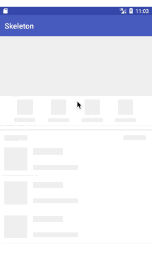

# skeleton

a library provide a easy way to show skeleton loading view like facebook and alipay

# Overview

# Demo Apk

you can scan the qrcode for download demo apk

# Getting started

In your build.gradle:

    dependencies {
       compile 'com.ethanhua:skeleton:0.1.1'
    }
    
# Feature
- No invasive，You don't need to make changes to existing code.
- Wide applicability，It is available for all views
# Usage
  for recyclerview:
 
       skeletonScreen = Skeleton.bind(recyclerView)
                                .adapter(adapter)
                                .count(10)
                                .show(R.layout.item_skeleton_news);
  for view: 
   
       skeletonScreen = Skeleton.bind(rootView)
                                .show(R.layout.layout_img_skeleton);
                                
  when data return you can call the method to hide skeleton loading view 
   
       skeletonScreen.hide()
        
 # Thanks
 
 https://github.com/sharish/ShimmerRecyclerView
 
 https://github.com/facebook/shimmer-android
 
 # License
 
    Copyright 2017, ethanhua
 
    Licensed under the Apache License, Version 2.0 (the "License");
    you may not use this file except in compliance with the License.
    You may obtain a copy of the License at
 
        http://www.apache.org/licenses/LICENSE-2.0
 
    Unless required by applicable law or agreed to in writing, software
    distributed under the License is distributed on an "AS IS" BASIS,
    WITHOUT WARRANTIES OR CONDITIONS OF ANY KIND, either express or implied.
    See the License for the specific language governing permissions and
    limitations under the License.
