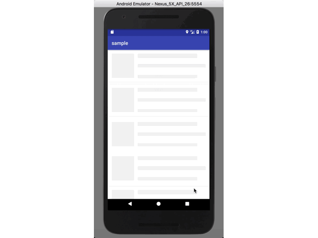
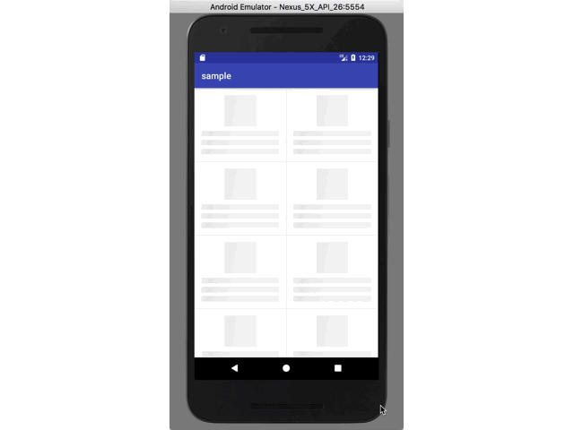
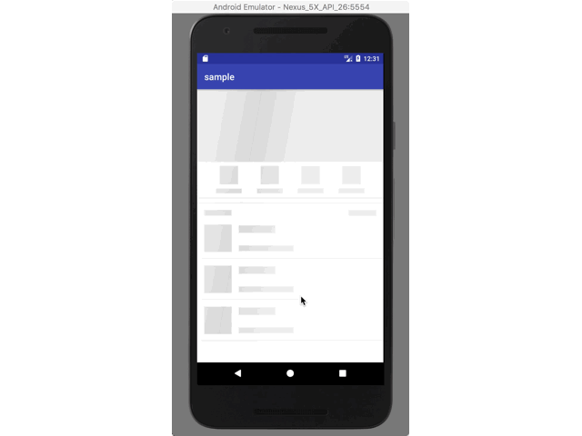
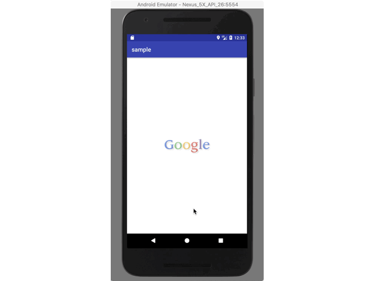

# skeleton

a liabrary provider a easy way to show skeleton loading view 

 
 

you can scan the qrcode for download demo apk

# Getting started

In your build.gradle:

    dependencies {
       compile 'com.ethanhua:skeleton:0.1.0'
    }
# Feture
- No invasive，You don't need to make changes to existing code.
- Wide applicability，It is available for all views
# Usage
  for recyclerview:
 
       skeletonScreen = Skeleton.bind(recyclerView)
                                .adapter(adapter)
                                .count(10)
                                .placeHolder(R.layout.item_skeleton_news)
                                .show();
  for view: 
   
       skeletonScreen = Skeleton.bind(rootView)
                                .placeHolder(R.layout.layout_img_skeleton)
                                .show();
  when data return you could call 
   
       skeletonScreen.hide()
        
 # Thanks
 
 https://github.com/sharish/ShimmerRecyclerView
 
 https://github.com/facebook/shimmer-android
