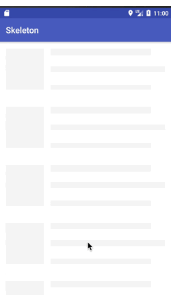
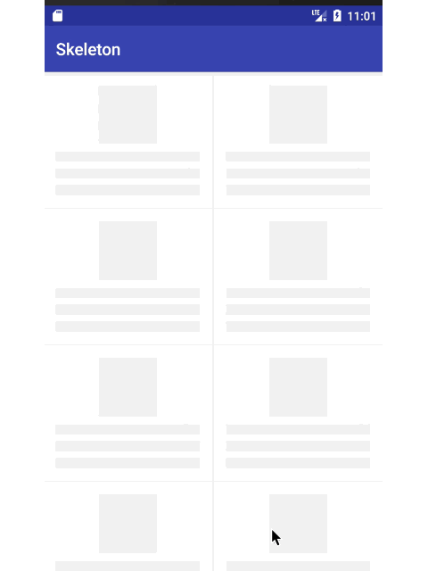
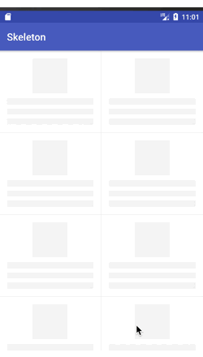
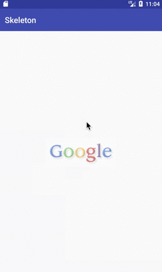

# Skeleton
[](http://www.apache.org/licenses/LICENSE-2.0)  
The library provides an easy way to show skeleton loading view like Facebook and Alipay. 
It now uses a memory optimised version of shimmer animation so it is even faster and you can animate bigger layouts as well.

# Preview







# Demo Apk

you can scan the qrcode for download demo apk


# Feature

- Light
- Noninvasive, you don't need to make changes to existing code.
- Wide applicability，it is available for all views
- Memory optimised

# Getting started

In your build.gradle:
```
dependencies {
       implementation 'com.ethanhua:skeleton:1.1.2'
       implementation 'io.supercharge:shimmerlayout:2.1.0'
    }
```
    
    

# Usage
  For RecyclerView:
  ```java
  skeletonScreen = Skeleton.bind(recyclerView)
                                .adapter(adapter)
                                .load(R.layout.item_skeleton_news)
                                .show();
  ``` 
       
                                
                         
  For View:
  ```java
  skeletonScreen = Skeleton.bind(rootView)
                                .load(R.layout.layout_img_skeleton)
                                .show();
  ```    
       
                                
                       
  More Config:
  ```java
  .shimmer(true)      // whether show shimmer animation.                      default is true
  .count(10)          // the recycler view item count.                        default is 10
  .color(color)       // the shimmer color.                                   default is #a2878787
  .angle(20)          // the shimmer angle.                                   default is 20;
  .duration(1000)     // the shimmer animation duration.                      default is 1000;
  .frozen(false)      // whether frozen recyclerView during skeleton showing  default is true; 
```
                            
  when data return you can call the method to hide skeleton loading view 
   ```java
  skeletonScreen.hide()
   ```
       
        
 # Thanks
 
 https://github.com/team-supercharge/ShimmerLayout
 
